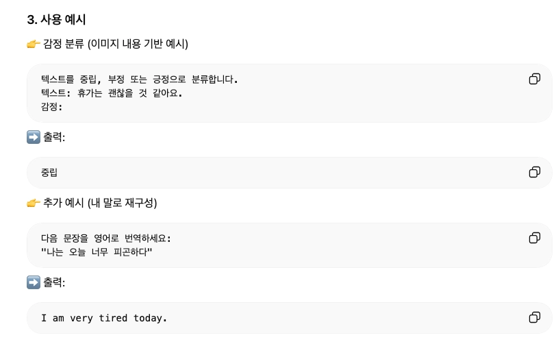
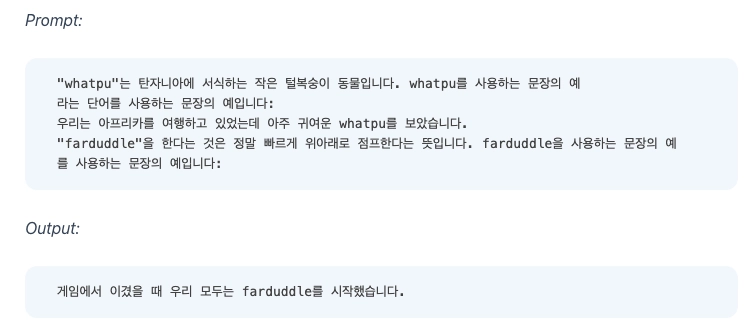
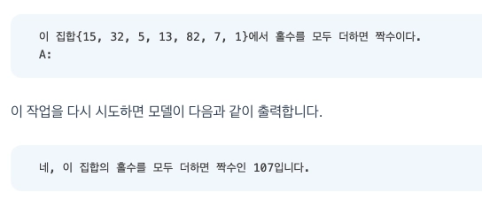
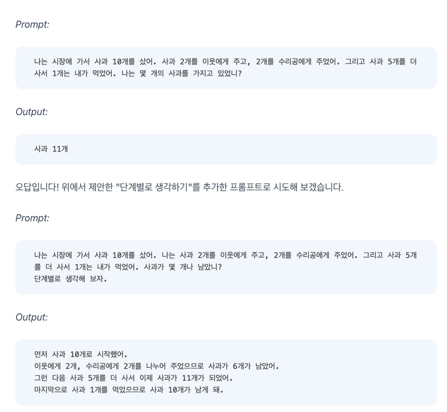
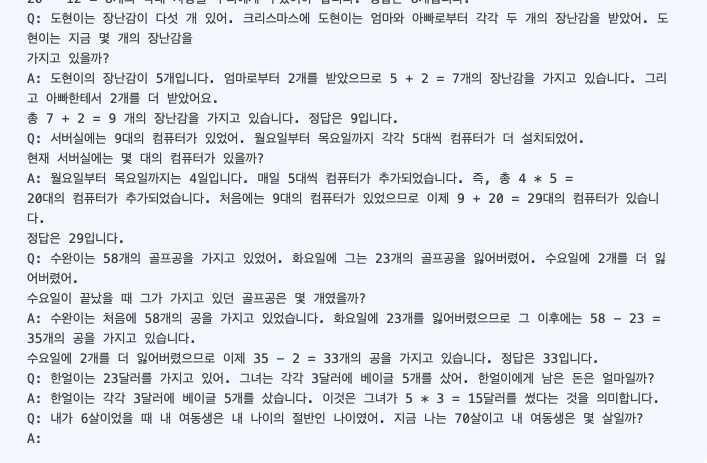
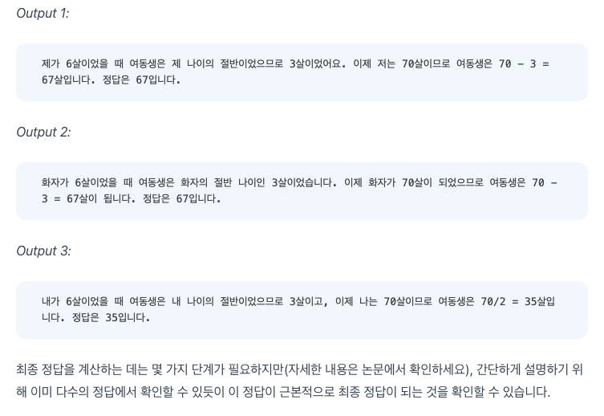

# 프롬프팅 종류와 설명

## 1. Zero-Shot

### 한 줄 정리
- 예시 없이 지시문만으로 모델이 바로 작업을 수행하게 하는 프롬프팅 방식이다.

### 핵심 원리
- LLM은 사전 학습(pretraining) 과정에서 방대한 패턴을 이미 학습함
- 그래서 추가 예시 없이도 지시만 보고 확률적으로 가장 적절한 답을 생성 (autogressive -> 자기회귀 생성)
- 즉, 이런 요청이면 이런 답이겠지라는 패턴 일반화 능력을 활용 하는 것

### 사용 예시

- 내가 따로 예시를 작성하지 않고 요구사항만 작성

### 언제 쓰면 좋은지
- 간단한 작업 (번역, 요약, 분류 등)
- 모델이 이미 충분히 학습했을 가능성이 높은 일반적인 문제
- 빠르게 결과를 얻고 싶을 때 (프롬프트 짧고 비용 적음)

## 2. Few-Shot

### 한 줄 정리
- 몇 개의 예시(입출력)를 함께 제공해서 모델이 패턴을 따라 작업하도록 유도하는 프롬프팅 방식

### 핵심 원리
- LLM은 in-context learning이 있음
- 즉, 프롬프트는 안에 있는 예시들을 보고 "아 이런 패턴이구나"라고 이해함
- 이후 입력에 대해 같은 패턴을 따라 autoregressive 하게 생성
- 핵심은 "학습 없이, 프롬프트 안에서 즉석으로 패턴을 따라한다"

### 사용 예시

- 예시를 하나 보여주면 모델이 그 패턴을 따라 새로운 단어도 자연스럽게 사용
- 경우에 따라 예시를 2-3개 추가하여 원하는 정확도를 높일 수 있음

- 하지만 복잡한 추론 작업은 오류가 발생할 수 있다. 이는 좀 더 많은 예시를 추가하거나 다른 방식의 프롬프팅이 필요함

### 언제 쓰면 좋은지
- 원하는 출력 형식이 명확할 때 (예: 분류, 번역 스타일, 포맷 맞추기)
- few-shot으로는 원하는 형태의 값을 얻기 힘들 때

## Chain-of-Thought (CoT)

### 한 줄 정의
- 모델이 최종 답뿐 아니라 중간 추론 과정(생각 과정)을 단계별로 생성하도록 유도하는 프롬프트 기법

### 핵심 원리
- LLM은 원래 한 번에 답을 생성하지만, 단계적으로 생각하라는 신호를 주면 추론 과정을 토큰 단위로 전개하면서 더 정확한 결과를 만듦

### 사용 예시

- 첫 번 째는 CoT가 아니다. 모델이 중간 계산 없이 직관적으로 답을 생성하다보니 계산 과정이 생략되면서 오류가 발생함
- 두 번 째는 CoT이다. 모델이 추론 과정을 단계적으로 생성해서 계산 흐름이 명확해져 오류가 감소했다.

### 언제 쓰면 좋은지
- 조건 등이 많아 단계적 추론이 필요한 문제

    
## Self-Consistency

### 한 줄 정의
- 같은 문제를 여러 번 다른 추론 경로(CoT)로 풀데 한 뒤, 가장 많이 나온 답을 선택하는 기법

### 핵심 원리
- LLM은 한 번 풀 때마다 추론 경로가 달라진다. 이때 정답은 여러 번 반복되고 오답은 랜덤하게 흩어진다. 이 때 다수결로 하면 정답에 수렴하는 원리를 사용하는 기법이다.

### 사용 예시

- Few-Shot CoT로 문제 풀이 방식을 유도하고, 동일한 프롬프트를 여러 번 실행하여 다양한 추론 결과를 얻은 뒤, 그 중 가장 많이 나온 답을 최종 정답으로 선택

### 언제 쓰면 좋은지
- CoT 쓰면 맞을 수도 있는데 불안정 할 때

# 각 프롬프트 방식 실습과 결과

## 실습 환경
- 사용한 모델 : gemini-2.5-flash
- SDK : googe-genai
- 실행 환경 : Mac OS
- 언어 : python

## 실습 전 가설
1. Zero-shot(Step 1)에서 정답률이 어느 정도일지 예측하고 이유를 설명하세요
    - easy는 대부분 정답을 맞출 것이고 medium, hard로 추론에 가깝기 때문에 갈수록 정답률은 떨어질 것이다.
2. 어떤 난이도(easy/medium/hard)에서 가장 큰 개선이 일어날지 예측하세요
    - medium 일부와 hard에서 큰 개선이 일어날 것으로 보인다.
3. 4가지 기법(Zero-shot → Few-shot → CoT → Self-Consistency) 중 **가장 큰 정답률 점프**가 어디서 일어날지 예측하세요
    - Few-shot -> CoT에서 큰 정답률로 점프할 것으로 예상 된다.

## 각 Step 별 프롬프트 전문
- zero-shot.py 참고
- few-shot.py 참고
- CoT.py 참고
- Self-consistency.py 참고

## 결과 요약

| Step | 기법 | 프롬프트 특징 | 정확도 |
|------|------|--------------|--------|
| Step 1 | Zero-shot | 규칙만 제공 | 83.33% |
| Step 2 | Few-shot | 예시 3개 추가 | 92.59% |
| Step 3 | CoT | 단계적 추론 추가 | 86.67% |
| Step 4 | Self-Consistency | CoT + 다수결 | 86.7% |

- 의외로 Few-shot이 일치율이 가장 높게 나왔다. 

## 오답 분석
1. Zero-shot
    - hard 에서 정답을 아예 틀린 것이 있다.
    - 일부는 정답은 맞으나, 기대한 출력 값과 일치하지 않아서 틀렸다고 표기 되었다.
2. Few-shot
    - hard에서 높은 정답률을 보임
    - 일부는 정답은 맞으나, 기대한 출력 값과 일치하지 않아서 틀렸다고 표기 되었다.
3. CoT
    - 틀린 정답은 없지만, 기대한 출력값과 달라서 틀렸다고 표기가 됨
4. Self-consistency
    - 틀린 정답은 없지만, 기대한 출력값과 달라서 틀렸다고 표기가 됨

## 결론과 인사이트
- 실질적으로 CoT와 Self-consistency는 100%의 정답률을 나타냈지만 정해둔 값과 일치하지 않아서 틀린 경우가 대부분이었다.
- few-shot 만으로도 충분히 높은 정답률을 보였는데, 이는 현재 LLM 모델이 기본적으로 추론 성능이 매우 좋아졌다는 것을 의미한다.
- 현재 테스트에 사용한 data 외에 더욱 어려운 추론 문제일 경우에 CoT 또는 Self-consistency의 사용 효력이 있을 것으로 판단된다.