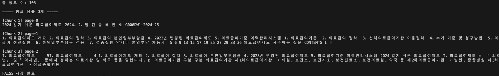
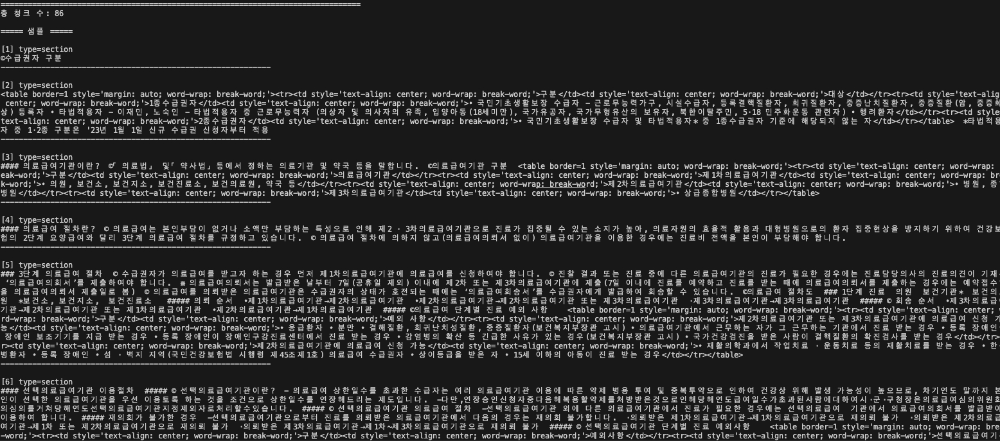

# 3주차 이론 과제: RAG의 구성 요소와 실습

## 개요
이번 과제에서는 RAG(Retrieval-Augmented Generation)가 무엇이고, 어떤 구성 요소로 이루어져 있는지를 조사합니다. 실습에서 LangChain 기반 RAG 파이프라인을 직접 구현하기 위한 사전 지식을 갖추는 것이 목적입니다.

## 필수 조사 항목

### 1. RAG란?
- Retrieval-Augmented Generation의 약자로 외부 지식을 검색(Retrieval)하여 LLM의 응답 생성(Generation)에 활용하는 구조이다.
- RAG 파이프라인의 전체 흐름: Indexing(문서 → 청크 → 벡터 → 저장) + Retrieval(질문 → 검색 → 생성)
- 필요한 이유
    1. 이전 LLM 모델은 최신 정보 반영이 불가했지만 RAG는 최신 정보 반영 가능하다.
    2. 이전 LLM 모델은 할루네이션 (환각) 즉, 없는 내용을 만들었지만 RAG는 실제 문서 기반 답변으로 할루네이션이 감소했다.
    3. 이전 LLM 모델은 근거가 부족했지만, RAG는 실제 문서 기반 답변으로 근거가 있다.
    4. 이전 LLM 모델은 도메인 데이터 활용이 어려웠지만, RAG는 사내 데이터 활용이 가능하다. PDF / DB / Wiki 등 연결 가능
- System Prompt 방식과 차이
    - System Prompt 방식은 전체 문서를 프롬프트에 포함하기 때문에 불필요한 컨텍스트까지 처리하게 되어 토큰 비용이 증가하고, 정보 과부하로 인해 모델의 응답 정확도 또한 저하될 수 있다.
    - RAG는 필요한 데이터만 그때그때 검색 해서 그걸 기반으로 LLM이 답을 생성하는 구조이다.

참고 자료:
- [Retrieval-Augmented Generation for Knowledge-Intensive NLP Tasks](https://arxiv.org/abs/2005.11401)
- [RAG Survey (Gao et al., 2024)](https://arxiv.org/abs/2312.10997)

### 2. RAG에서 사용되는 용어

| 용어 | 조사 내용 |
|------|----------|
| Chunking | 문서를 분할하는 방법. chunk_size = 청크 길이, chunk_overlap = 겹치는 구간(문맥 유지용) |
| Embedding | 텍스트를 벡터로 변환하는 방법. ex. 강아지는 개랑 유사한 벡터 값임 |
| Vector Store | 벡터를 저장하고 유사도 검색하는 저장소. FAISS, Chroma 등 |
| Retriever | 질문과 유사한 청크를 검색하는 컴포넌트. Top-K = 가장 유사한 문서 K개 |
| Generation | 검색된 청크를 바탕으로 LLM이 답변을 생성하는 단계 |

참고 자료:
- [OpenAI Embeddings Guide](https://platform.openai.com/docs/guides/embeddings)
- [FAISS Getting Started](https://github.com/facebookresearch/faiss/wiki/Getting-started)
- [Chroma Getting Started](https://docs.trychroma.com/getting-started)

### 3. 외부 데이터 소스 기반 응답 생성

- LLM 단독 응답 vs 외부 데이터를 검색하여 응답하는 방식의 차이
    - LLM 단독 (기본 GPT 방식)
        - 모델이 이미 학습된 지식만으로 답변
        - 최신 정보 부족해서 틀린 정보(할루시네이션) 가능성 있음
- API 호출 흐름: 질문 → 임베딩 → 벡터 검색 → 컨텍스트 구성 → LLM 호출
- 할루시네이션 방지에서 RAG가 하는 역할
    - 기존 LLM은 모르면 그냥 그럴듯하게 지어내는 정도 였음
    - RAG는 근거(외부 데이터) 기반 답변을 함

### 4. LangChain 기반 RAG 파이프라인 구조

| 단계 | LangChain 컴포넌트 |
|------|-------------------|
| 문서 로딩 | Document Loader (PyPDFLoader 등) |
| 청킹 | Text Splitter (RecursiveCharacterTextSplitter 등) |
| 임베딩 | Embeddings (OpenAIEmbeddings 등) |
| 벡터 저장 | Vector Store (FAISS, Chroma 등) |
| 검색 + 생성 | Retriever + Chain |

**문서 로딩**

- 역할 : 외부 데이터를 LangChain이 처리할 수 있는 형태로 변환
- 대표 컴포넌트 :
    - PyPDFLoader → PDF
    - TextLoader → txt
    - CSVLoader → CSV
    - WebBaseLoader → 웹페이지

**청킹**

- 역할 : 긴 문서를 LLM이 처리 가능한 작은 단위로 분할
- 대표 컴포넌트
    - RecursiveCharacterTextSplitter
- 필요한 이유
    - LLM 토큰 제한 때문
    - 검색 정확도 향상

**임베딩(Embedding)**

- 역할 : 텍스트 → 의미 기반 벡터 변환
    - 단어가 아니라 의미 유사도 기반 검색 기반
- 대표 컴포넌트
    - OpenAIEmbeddings
    - HuggingFaceEmbeddings

**벡터 저장 (Vector Store)**

- 역할 : 임베딩된 데이터를 저장 + 검색 가능하게 만듦
- 대표 컴포넌트
    - FAISS (로컬, 빠름)
    - Chroma (간편, 로컬 DB)
    - Pinecone (클라우드)

**검색 + 생성 (Retrieval + Generation)**

- Retriever : 질문 → 관련 문서 검색
- Chain : LLM 연결. 검색된 문서를 기반으로 답변 생성
    - 대표 체인
        - RetrievalQA
        - ConversationalRetrievalChain

참고 자료:
- [LangChain RAG Tutorial](https://python.langchain.com/docs/tutorials/rag/)
- [LlamaIndex Starter Tutorial](https://docs.llamaindex.ai/en/stable/getting_started/starter_example/)

## 2. 실습 과제 예측

### 1. 가설
- RAG 방식은 기존 System Prompt 방식과 비교했을 때, 전체 문서를 입력하지 않고 질문과 관련된 정보만 선별하여 활용하기 때문에 토큰 사용량과 비용이 크게 감소할 것으로 예상된다.
- 또한, 검색된 근거 문서를 기반으로 답변을 생성하기 때문에 답변의 근거가 명확해지고 신뢰도가 향상될 것이다.
- 다만 정확도는 다음 요소에 따라 달라질 수 있다.
    - Chunking 전략
    - Embedding 모델 성능
    - Retriever의 Top-K 설정
    - LLM 모델의 이해 및 생성 능력

### 2. 간단한 예측
1. 의료급여 PDF를 청킹할 때 가장 큰 어려움이 무엇일지 예측하세요
- 표 구조와 조건 기반 문장을 의미 단위로 유지하는 것이 가장 어려울 것이다.
2. Golden Dataset의 5문제 중 어떤 난이도의 질문에서 검색 실패가 많을지 예측하고 이유를 설명하세요
- 여러 조건을 결합해야 하는 hard 난이도 문제가 가장 실패가 많을 것으로 보인다.

## 3. 실습

### 배경
2주차에서는 의료급여 본인부담률 표 전체를 system prompt에 넣고 프롬프트 엔지니어링으로 정답률을 개선함. 하지만 이 방식은 데이터가 커지면 한계가 발생

이번 실습은 LangChain(또는 LlamaIndex)을 사용하여 RAG Indexing 파이프라인을 직접 구축한다. 의료급여 PDF를 청킹하고, 임베딩하여 벡터 저장소에 저장한 뒤, 질문으로 검색이 되는지 확인하는 것이 목표이다.

### 데이터
- 2024 알기 쉬운 의료급여제도 pdf

### 실습 구조

**Step1 : Golden Dataset 구축**
- easy: 2(단일 조건), medium: 2(2-3개 조건 조합), hard:1(다중 조건 + 계산 or 예외)
- golden_dataset.jsonl 참고

**Step2 : RAG Indexing 파이프라인 구축**
**두 가지 방식을 진행**
- PDF
    1. PyPDFLoader 사용하여 pdf 로더
    2. 청킹
        - chunk_size=300,
        - chunk_overlap=50
    3. 임베디드 진행
        - OpenAIEmbeddings 사용
    4. FAISS에 벡터 저장

- 마크다운
    1. TextLoader 사용하여 md 로더
    2. 청킹
        - chunk_size=300,
        - chunk_overlap=50
        - "---" 로 소제목 기준으로 구분하여 청킹
    3. 임베디드 진행
        - OpenAIEmbeddings 사용
    4. FAISS에 벡터 저장

**Step3 : 검색 품질 확인**

- 첫 번째 테스트 요약
| 질문 | 난이도 | 검색 결과 |
|------|-----|------------------------------------------------------------------|
| q1 | easy | Top1 에서 정확한 근거를 가져왔으므로 성공 | 
| q2 | easy | 검색 실패 |
| q3 | medium | Top1에서 근거는 살짝 부족함 |
| q4 | medium | 검색 실패 |
| q5 | hard | 전체적으로 근거가 애매함 실패라고 봐야 할 듯 |

 - 자세한 결과는 retrieval_results_pdf.txt 참고

- 두 번째 테스트 요약 
    - md로 파싱 후, --- 구분자로 청크 나눔

| 질문 | 난이도 | 검색 결과 |
|------|-----|------------------------------------------------------------------|
| q1 | easy | Top1 에서 정확한 근거를 가져왔으므로 성공 | 
| q2 | easy | 검색 실패 |
| q3 | medium | Top1 에서 정확한 근거를 가져왔으므로 성공 |
| q4 | medium | 검색 실패 |
| q5 | hard | 식대에 대해서만 맞고 반은 틀림 |

 - 자세한 결과는 retrieval_results_md.txt 참고

### 실습 결과 
- 예상대로 easy, medium에서 정답이 나왔다.
- 실패 한 것들을 보면 총 2 가지로 파악이 된다.

    1. 로더 이슈 
        - 로더 자체가 기본이면 표를 제대로 인식 못한다.
        - 해결
            - 마크다운으로 바꾼 형태로 로더를 사용
            - 로더 모델 변경 -> pdfplumber(표 추출에 강점)
    2. chunk 이슈
        - pdf로 로더를 진행할 경우 표는 깨지는 경우가 있어 chunking에 한계가 있음
        - 이를 해결하기 위해 md로 테이블을 포함한 소제목 위준으로 구분해서 chunking을 시도했지만, 이번에는 범위가 너무 커서 정확도가 크게 향상되지는 못했다.
     
### 인사이트
1. 의료 급여는 표 형태가 많아 표 단위로 청킹해야 한다. 표를 일반 텍스트 처럼 고정 크기로 자르면 행/열 깨진다.
2. 의료 급여 데이터를 마크다운으로 바꾸는 것이 훨씬 효과적이다. 
3. chunking 범위를 여러 번 변경 해보면서 가장 최적의 성능을 보이는 지점을 찾아야 한다.

