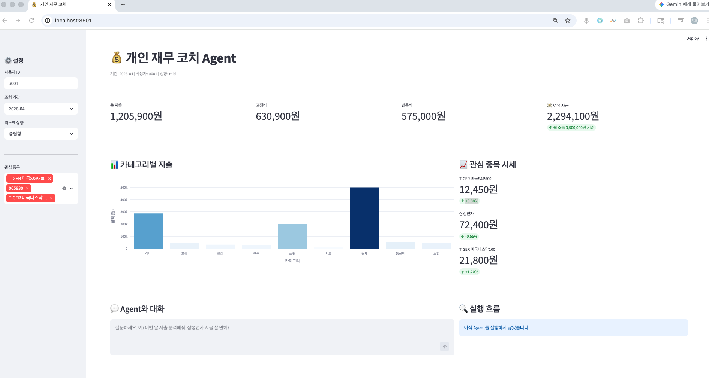

# 7주차 AI Agent 구현 프로젝트

## 프로젝트 링크

- Repository: https://github.com/jasonpark112/finance-coach-agent
- 6주차 설계 PR 또는 design.md: [design.md](./design.md)

## 구현한 Agent

- **Agent 이름**: 개인 재무 코치 Agent
- **해결하려는 문제**: 지출 내역 분석과 투자 추천이 분리되어 있어 통합 재무 판단이 어려운 문제
- **타깃 사용자**: 재테크에 관심 있지만 가계부 분석과 투자 판단을 따로 해야 해서 귀찮아 미루는 20~30대 직장인

---

## 6주차 설계와의 연결

- **유지한 설계**: ReAct 패턴, Tool 5개 명세, max_steps=15 종료 조건, 루프 감지(동일 Tool·인자 3회 반복), Tool 실패 처리
- **변경한 설계**: `generate_recommendation`을 LLM 내부 호출 대신 규칙 기반 함수로 구현
- **변경 이유**: outer agent가 이미 Claude이므로 내부 LLM 재호출은 불필요하고, 규칙 기반으로도 동일한 추천 결과를 얻을 수 있음

---

## 사용한 Tool

| Tool 이름 | 실제/API/mock | 역할 |
|-----------|---------------|------|
| `get_transactions` | mock | 지정 유저·기간의 지출 내역 조회 |
| `analyze_spending` | 내부 계산 | 고정비·변동비 분류 및 여유 자금 계산 |
| `get_stock_price` | mock | 종목·ETF 현재 시세 및 등락률 조회 |
| `get_news_summary` | mock | 종목 관련 최신 뉴스 3~5건 요약 |
| `generate_recommendation` | 내부 계산 | 여유 자금·리스크 성향 기반 포트폴리오 추천 생성 |

> 모든 Mock 데이터는 실제 오픈뱅킹·증권사 API 스키마와 동일하게 설계하여, 추후 함수 내부만 교체하면 Agent 로직은 그대로 동작합니다.

---

## 실행 패턴

- **선택한 패턴**: ReAct (Reasoning + Acting)
- **이유**: 요청마다 Tool 조합과 스텝 수가 달라지고, 이전 Observation 결과를 보고 다음 Tool을 판단해야 하기 때문
- **흐름**:

```
사용자 입력
  → [Thought] Claude가 필요한 Tool과 순서 판단
  → [Action] Tool 호출
  → [Observation] Tool 결과 수신
  → [Thought] 정보가 충분한지 판단 → 부족하면 Action으로 돌아감
  → 충분하면 최종 답변 생성
```

---

## 실행 방법

```bash
# 패키지 설치
pip install -r requirements.txt

# 환경 변수 설정
cp .env.example .env
# .env 파일에 ANTHROPIC_API_KEY 입력
```

### 웹 대시보드 (향후 Multi-Agent 확장 기반)

```bash
streamlit run app.py
```

브라우저에서 `localhost:8501` 자동 오픈. 지출 차트·종목 시세·Agent 채팅을 한 화면에서 확인 가능. 대시보드 구조는 향후 Finance Analyst / Market Research Agent를 병렬로 운영할 때 각 Agent의 실행 상태를 실시간으로 시각화하는 기반이 된다.

## 대시보드 미리보기



### CLI

```bash
# 단일 입력
python src/cli.py "이번 달 지출 분석해줘"

# 대화형 모드
python src/cli.py
```

> 실행은 반드시 `finance-coach-agent/` 루트에서 진행해야 `.env`를 올바르게 로드합니다.

---

## 예시 실행

### 예시 1 — 소비 분석

입력:

```text
이번 달 내가 어디에 제일 많이 썼어? 카테고리별로 정리해줘
```

Tool 호출 흐름 (3 step):

```
Step 1 → get_transactions(user_id="u001", period="2026-04")
Step 2 → analyze_spending(transactions=[...])
Step 3 → 최종 답변
```

출력:

```text
## 📊 2026년 4월 카테고리별 지출 현황

| 순위 | 카테고리 | 금액      | 비중  |
|------|---------|-----------|-------|
| 1    | 월세    | 500,000원 | 50.8% |
| 2    | 쇼핑    | 156,000원 | 15.8% |
| 3    | 식비    | 152,500원 | 15.5% |
| 4    | 통신비  |  55,000원 |  5.6% |
| 5    | 교통    |  45,000원 |  4.6% |
| 6    | 보험    |  45,000원 |  4.6% |
| 7    | 구독    |  30,900원 |  3.1% |

- 이번 달 총 지출: 984,400원
- 고정비 (월세·통신비·보험·구독): 630,900원
- 변동비 (식비·쇼핑·교통): 353,500원
- 추정 여유 자금: 2,515,600원
```

---

### 예시 2 — 소비 기반 ETF 투자 추천

입력:

```text
내 소비 패턴 보고 투자할 수 있는 여유 자금이랑 맞는 ETF 추천해줘
```

Tool 호출 흐름 (5 step):

```
Step 1 → get_transactions(user_id="u001", period="2026-04")
Step 2 → analyze_spending(transactions=[...])
Step 3 → get_stock_price("TIGER 미국S&P500")
         get_stock_price("KODEX 200")
         get_stock_price("TIGER 미국나스닥100")
         get_news_summary("S&P500 ETF")
         get_news_summary("나스닥100 ETF")
Step 4 → generate_recommendation(surplus=2515600, risk="mid", market_data={...})
Step 5 → 최종 답변
```

출력:

```text
## 📈 ETF 투자 추천 (중립형 · mid)

투자 권장 금액: 1,257,800원 (여유 자금의 50%)
비상금 유지:   1,257,800원 (여유 자금의 50%)

| ETF               | 현재가    | 등락률 | 비중 | 투자 금액    |
|-------------------|-----------|--------|------|-------------|
| TIGER 미국S&P500  | 12,450원  | +0.8%  | 50%  | 약 628,900원 |
| TIGER 미국나스닥100| 21,800원  | +1.2%  | 30%  | 약 377,340원 |
| KODEX 200         | 35,200원  | +0.3%  | 20%  | 약 251,560원 |
```

---

### 예시 3 — 특정 종목 리서치

입력:

```text
삼성전자 지금 살 만해? 최근 뉴스랑 주가 흐름 같이 분석해줘
```

Tool 호출 흐름 (2 step):

```
Step 1 → get_stock_price("005930")
         get_news_summary("삼성전자")
Step 2 → 최종 답변
```

출력:

```text
## 삼성전자 (005930) 종합 분석

현재가: 72,400원 | 등락률: -0.55%

최근 뉴스:
1. 2분기 실적 회복 기대감 — 반도체 업황 개선으로 영업이익 반등 전망
2. HBM 공급 확대로 AI 수혜 기대 — 엔비디아향 HBM3E 공급 확대 계획 발표
3. 외국인 5거래일 연속 순매수 — 외국인 투자자 귀환에 주가 반등 모색

✅ 긍정 신호: HBM3E·AI 수혜 기대, 외국인 연속 순매수, 실적 반등 전망
⚠️ 주의 신호: 당일 소폭 하락 중(-0.55%), 업황 회복 확인 필요
```

---

## 실행 로그 분석

### 설계서 예상 흐름 vs 실제 실행 흐름

| 요청 | 설계 예상 흐름 | 실제 흐름 | 일치 여부 |
|------|--------------|-----------|---------|
| 소비 분석 | get_transactions → analyze_spending | get_transactions → analyze_spending | 일치 |
| 투자 추천 | get_transactions → analyze_spending → get_stock_price → get_news_summary → generate_recommendation | 동일 (Step 3에서 시세·뉴스 병렬 호출) | 일치 |
| 종목 리서치 | get_stock_price → get_news_summary | get_stock_price + get_news_summary 동시 호출 | 일치 |

### 주요 관찰 사항

- **예시 2 Step 3**: Claude가 시세 조회 3건과 뉴스 요약 2건을 **하나의 스텝에서 병렬로** 호출했다. 설계서에서는 순차 호출을 가정했으나 Claude가 자율적으로 병렬 처리를 선택해 응답 효율을 높였다.
- **예시 3**: 지출 데이터가 전혀 필요 없는 요청임을 Claude가 정확히 판단, `get_transactions` 없이 `get_stock_price` + `get_news_summary`만 호출했다. 설계서 예상과 일치한다.
- **불필요한 Tool 호출**: 없었음. 모든 Tool 호출이 최종 답변 생성에 기여했다.
- **종료 조건**: 세 예시 모두 `end_turn` 신호로 정상 종료. max_steps 초과나 루프 감지는 발생하지 않았다.

---

## 성공 판정 기준 확인

| # | 기준 | 결과 | 근거 |
|---|------|------|------|
| 1 | 소비 분석 요청 시 `get_transactions` → `analyze_spending` 순서로 호출 |  통과 | 예시 1·2 로그에서 Step 1→2 순서 확인 |
| 2 | 투자 추천 시 `get_stock_price`와 `get_news_summary`를 모두 호출 |  통과 | 예시 2 Step 3 로그에서 두 Tool 모두 호출 확인 |
| 3 | Tool 실패 시 재시도 또는 fallback Tool로 전환 |  구현 | `ok=false` 반환 시 Claude가 에러 코드를 읽고 대안 판단하도록 설계. `TOOL_FUNCTIONS` 에러 핸들링 코드로 확인 |
| 4 | 최종 응답에 여유 자금 금액과 추천 종목명 포함 |  통과 | 예시 2 출력에 여유 자금 2,515,600원, TIGER 미국S&P500 등 포함 확인 |
| 5 | 모든 요청이 15 step 이내에 종료 |  통과 | 예시 1: 3step, 예시 2: 5step, 예시 3: 2step |

---

## 구현하며 배운 점

- **Claude의 자율적 병렬 호출**: Tool use API에서 Claude는 독립적인 Tool 여러 개를 하나의 응답에 묶어 동시에 호출할 수 있다. 설계서에서는 순차 실행만 고려했으나, 실제로는 Claude가 병렬 처리를 스스로 선택해 응답 속도가 개선됐다.
- **Tool 반환 스키마의 중요성**: `{ ok, data, error }` 구조를 일관되게 유지하면 Claude가 실패 여부를 명확히 파악하고 다음 행동을 판단하기 쉬워진다.
- **시스템 프롬프트는 짧을수록 좋다**: Tool 사용 조건을 과도하게 명시하면 Claude의 유연한 판단을 방해한다. 핵심 규칙만 남기고 나머지는 Tool description에 위임하는 것이 효과적이다.

---

## 향후 고도화 계획

현재는 Mock 데이터 기반의 최소 동작 CLI 구현이다. 실제 개인 투자에 활용하기 위해 아래 단계로 고도화할 예정이다.

### Phase 1 — 로컬 고도화 (진행 중)

-  **Streamlit 웹 대시보드** 구현 완료
  - 지출 카테고리별 바 차트 (기간 전환 가능)
  - 관심 종목 시세 카드 (watchlist 선택)
  - Agent 실행 흐름 실시간 표시 (Step별 Tool 호출 현황)
  - 채팅으로 직접 질문·의논하는 혼합형
-  **Mock 데이터 보강** 완료 (2달치, 27건, 카테고리 9개)
-  **메타데이터 추가** 완료 (tool_sequence, data_source, fallback 여부, 생성 시각)
-  **실제 API 연동** (예정)
  - `get_transactions`: 오픈뱅킹 API (금융결제원)
  - `get_stock_price`: 한국투자증권 KIS Open API
  - `get_news_summary`: 네이버 뉴스 검색 API

### Phase 2 — AWS 배포
- EC2/ECS에 Streamlit 앱 배포
- RDS/DynamoDB로 지출 히스토리·추천 기록 영속화
- AWS Secrets Manager로 API 키 관리
- CloudWatch로 모니터링·알림

### Phase 3 — DevOps
- GitHub Actions CI/CD 파이프라인 구축
- 코드 push → 자동 테스트 → 자동 배포

### Phase 4 — 기능 고도화
- 개인화 메모리: 투자 성향 프로필, 관심 종목 watchlist, 추천 히스토리 추적
- 자동화: 주기적 지출 요약 + 시장 동향 리포트, 조건부 알림
- RAG 도입: 공시·애널리스트 리포트 문서 검색 기반 분석
- Multi-Agent: Finance Analyst / Market Research Agent 분리 후 병렬 처리
